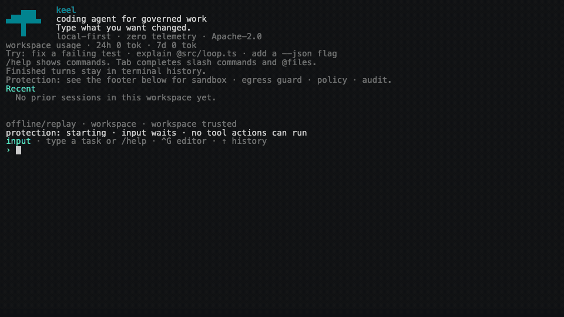

# keel

A governance-native, open-source agent harness.

<!-- "memory-first" is a roadmap goal, not a shipped feature. The durable memory plane is Phase 3
     and `packages/memory` is a placeholder; kept out of the tagline until it exists (P1-8). -->

keel runs a coding agent behind a wall its governed tool surface cannot talk its way through,
assuming the v1 kernel and OS user are not compromised. The model requests governed actions.
A separate **warden** process decides what runs, under a hash-pinned policy the model cannot
rewrite. Every governed action, allowed or denied, lands in a tamper-evident audit record the
agent cannot write through that tool surface.

The result is high autonomy inside boundaries that hold even when the model is wrong or
adversarially steered.

[](docs/demo/keel-deny-audit.cast)

_The production TUI and real kernel → warden → policy → audit path. A deterministic offline replay
supplies only the model turns—no provider key or network; [run it locally](docs/demo/run-deny-audit-demo.mjs)._

Keel vendors Anthropic's [`@anthropic-ai/sandbox-runtime`](NOTICE) v0.0.59 under Apache-2.0 to
orchestrate Seatbelt and bubblewrap. Keel adds the out-of-process Warden, policy mediation,
tamper-evident audit path, and connect-time address guard described in
[ADR-0005](docs/adr/0005-vendoring-sandbox-runtime.md).

## Quickstart

```bash
npm i -g keel-harness        # or run any command below as: npx keel-harness <command>
keel doctor                  # environment preflight
keel auth set anthropic      # paste your API key (stored 0600, never echoed)
keel                         # start an interactive session
```

The global or `npx` install above is the product path. A source checkout is for contributing and
development:

```bash
corepack enable && pnpm install
pnpm test
pnpm typecheck && pnpm lint && pnpm format
```

Do not treat `pnpm keel` pointed at Keel's own source tree as an enforcement demonstration: the
governed workspace could rewrite the Warden/runtime bytes it is testing, and `keel doctor` reports
that reduced-enforcement layout. The released carrier requires Node 20+ and ripgrep; its CI matrix
tests Node 20, 22, and 24. `keel doctor` checks the OS sandbox and prints one copy-paste fix when
something is missing.

New here: [getting started](docs/guide/getting-started.md) · [what keel is](docs/architecture.md)
· [the honest security model](docs/guide/security-model.md) ·
[status and limitations](docs/status.md).

> **DISCLAIMER:** This note is the only thing in this repo that was not written by or with AI -
> while keel aspires to be one of the most secure agent harnesses available, it should not be
> used for mission or business critical applications until/unless vetted rigorously by the OSS
> community. My goals in building keel were to 1) learn more about harness engineering, and 2)
> attempt to address a gap I saw in the harness market vis a vis native runtime security that
> cannot be circumvented by an LLM. As such, this harness is also likely not for users who
> prefer to run agents fully on 'auto' mode - while we do have an Autopilot mode that reduces
> agent / human interrupts, this harness aims to solve a different problem and is much more
> human-in-the-loop centric by design.

## Evidence

Where the claims stand, and how to verify them yourself:

| What | Where it stands | Reproduce |
| --- | --- | --- |
| Tests | 7,527 automated tests passed; 37 skipped | `pnpm test` |
| Coverage | 97.79% statements / 93.58% branches, enforced gate (per-file ≥90%; warden ≥95% lines/functions/statements) | `pnpm test:cov` |
| Security suite | 1,123 adversarial / denied-path tests passed | `pnpm test:security` |
| Real OS sandbox | Seatbelt (macOS) + bubblewrap (Linux) denial probes run in CI | `pnpm test:sandbox:real` |
| Connect-time egress guard | The vendored SRT TCP backend resolves, checks, and pins every destination before a new connection | `pnpm test:egress-product` |
| Audit integrity | tamper-evident hash chain + Ed25519 checkpoints (local `0600` key, readable by the same OS user) + offline evidence-bundle verifier | `keel audit verify <bundle>` |
| Capability benchmarks | TerminalBench numbers with full caveats: single-trial, subset, sandbox-off | [docs/benchmarks.md](docs/benchmarks.md) |

**Connect-time egress guard.** A hostname grant is not enough to open a socket. On the vendored SRT
TCP backend, the warden resolves the destination immediately before each new connection, rejects the
whole answer set if any address is unsafe or not covered by a narrow operator exception, and pins the
vetted set to the final dial. This scope does not include provider API calls, UDP/QUIC, or alternate
sandbox backends; see the [security model](docs/guide/security-model.md) and
[ADR-0086](docs/adr/0086-warden-owned-egress-address-guard.md).

Test and coverage figures were measured on 2026-08-13 at commit
[`3f16f53`](https://github.com/keel-harness/keel/commit/3f16f5382bffbb14a0a9a0c403fa79f2de37ff7f).
Exact values, fractions, commands, and the staleness window live in the
[evidence-number ledger](docs/quality/evidence-numbers.json).

## Status

**keel is pre-alpha and publicly available.** `keel-harness@0.1.2` is published on npm and
tagged `latest`, with a matching [GitHub Release](https://github.com/keel-harness/keel/releases/tag/v0.1.2),
but this is **not a stable or public-alpha release**.

Keel is currently solo-maintained and has not received an independent security audit. Treat its
tests, claim ledger, and reproducible evidence as material for review, not as a substitute for one.

Governed mode covers `bash`, capability-negotiated trusted direct-argv `process.run`, the trusted typed
file tools (`read`, `search`, `write`, `edit`), and reviewed, pinned local-stdio MCP calls through the
spawned Warden. `process.run` accepts one literal argv vector for a direct executable; it does not add
shell composition, environment, cwd, stdin, or background authority. The MCP proof is deliberately
narrow: remote, localhost, and unreviewed MCP transports, general plugin/registry APIs, reusable
grants, and MCP resources, prompts, sampling, and elicitation are not claimed. Session-helper/internal
surfaces such as `plan`, `skill`, and `retrieve`, provider API calls, and future tools are likewise
not counted as governed product execution proof.

The published `keel-harness@0.1.2` carrier includes two bounded publication paths for trusted interactive macOS/Linux
sessions. With Git 2.x (2.39 or newer), typed `git.push` can create or fast-forward one non-default
feature branch to one approved full commit OID over canonical HTTPS, through `srt:vendored` verified
TLS and connect-time address guarding. The Warden offers both publication tools only when
`srt-launch-authority/v1` establishes unique authenticated proxy endpoints and an immutable
credential/configuration snapshot for that launch; cleanup revokes and drains that authority.
Exact deny-all launches receive no proxy endpoint or credential authority at all; the immutable OS
sandbox profile is endpointless and network-denied.
After that head exists on GitHub.com, a separate typed
`github.pr.create` request can create one same-repository pull request with an exact title, body,
base, head OID, draft flag, and maintainer-modification flag. Each occurrence has its own complete,
once-only human approval; push approval never authorizes PR creation.

The Warden resolves an operator system/global Git credential helper without exposing its value,
records intent before either mutation, and independently verifies the resulting ref or pull request.
`keel doctor` checks only that the helper command has eligible system/global authority; it does not
look up or promise a path-scoped credential. If either publication tool reports
`credential-unavailable` before review or after approval, run
`gh auth login --git-protocol https && gh auth setup-git && keel doctor`, then submit a fresh request.
Force, deletion, tags, default-branch push, SSH, redirects, project credential helpers, reusable
grants, cross-repository PRs, arbitrary forge APIs, merge/auto-merge, labels, reviews, releases,
deployments, and automatic retry remain blocked. Raw `process.run git push` remains terminal.
The compact V2 registry makes the 25,536-port range—not serialized JSON size—the first bound and
permanently excludes retired network-bearing endpoints until a deliberate future migration. Exhausting
that finite space withholds publication rather than reusing authority; endpointless offline execution
remains available.

The npm and GitHub `0.1.2` tarballs are byte-identical to the inspected staged candidate. Current
source adds two fail-closed reliability/DX corrections that are not in `0.1.2`: expected credential-
broker readiness failures get actionable recovery, and GitHub's same-repository
`maintainerCanModify: false` normalization is accepted only after every consequential field verifies.
On `0.1.2`, those provider cases can surface as an internal or indeterminate result; do not retry
automatically—inspect GitHub and the audit record first.

**[docs/status.md](docs/status.md) is the full account** — every limitation, the audit and signing
boundaries, the release flow, and a note on running the test suite locally. Read it before you
rely on any claim here.

## Autonomy (Autopilot is not YOLO)

Autonomy in keel is a set of **policy postures over the warden's enforcement**, not a promise
about how the model behaves. In every mode the model can only *request*; the out-of-process
**warden decides** under a hash-pinned policy the model cannot rewrite.

- **Guided** (default): in an interactive terminal session, consequential actions may pause for your
  approval; the warden still enforces.
- **Autopilot**: the model acts *without a prompt*, but only for actions the warden has already
  proven contained and low-risk. It never lets the model declare itself safe, raise its own mode,
  change policy, or turn a `deny` into an `allow`. Boundary expansion still routes to review.

Existing scoped authority, such as an exact session or Plan grant or an eligible Autopilot rule,
may resolve a review before any prompt. If a one-shot `keel run -p` still needs a live human
decision, keel cannot ask: it attempts to close the review as denied and exits nonzero. A confirmed
denial means the action did not run. A failed or indeterminate settlement is labeled; do not retry
automatically, and inspect the audit record.

"YOLO" means reduced or absent enforcement. keel never conflates the two in the UI, receipts, or
docs. See the [policy guide](docs/guide/policy-guide.md) for modes, approvals, and grant scopes.

## Configuration

All optional, with sensible defaults. The most common:

| Variable | What it does | Default |
| --- | --- | --- |
| `KEEL_PROVIDER` | Model provider: `anthropic` · `openai` · `google` · `openai-compatible`. | `anthropic` |
| `KEEL_MODEL` | Model id (required for non-Anthropic providers). | pinned Anthropic Sonnet |
| `KEEL_MAX_TOKENS` | Per-run effective-cost token cap (the primary spend ceiling). Cached input is discounted, so this is cost-true, not a raw-token count. | unset |
| `KEEL_MAX_TURNS` | Hard cap on agent loop turns. Not a spend cap; pair with a token cap. | 50 |
| `KEEL_MAX_WALL_SEC` | Wall-clock budget in seconds; keel self-stops gracefully with a `deadline` outcome. | unset |
| `KEEL_HOME` | Where keel stores sessions, audit, and config. | `$XDG_CONFIG_HOME/keel`, else `~/.config/keel` |

The full list, including budget, compaction, verification, and tool-behavior knobs, is in
the [reference](docs/guide/reference.md).

## Documentation

- [docs/architecture.md](docs/architecture.md) is the one-page tour.
- [docs/guide/](docs/guide/) holds the guides: getting started, concepts, reference,
  policy and approvals, untrusted repos, the security model, and audit and sessions.
- [docs/status.md](docs/status.md) is what is and is not true today.
- [docs/quality/claim-ledger.md](docs/quality/claim-ledger.md) maps every security claim to
  its evidence and honest limits.
- [docs/README.md](docs/README.md) is the full index, by audience.

Going deeper: [`MASTER_SPEC.md`](MASTER_SPEC.md) is the full governing spec and
[`AGENTS.md`](AGENTS.md) is the engineering charter.

## Develop

Contributor CI tests Node 20, 22, and 24. pnpm is pinned via the `packageManager` field. Enable
[Corepack](https://nodejs.org/api/corepack.html) so you get the exact version. If the `corepack`
command is unavailable — including on Node 25+ by default — install Corepack separately first; do
not silently substitute an unpinned pnpm:

```bash
corepack enable   # pins pnpm to the version in package.json
pnpm install
pnpm test:cov     # unit + property tests + coverage gate
pnpm typecheck && pnpm lint && pnpm format
```

The repository layout is described in the
[architecture deep-dive](docs/guide/architecture.md#repository-layout).

`pnpm package` builds the npx package and the self-contained binaries into `build/`. Bun is a
build/CI-only tool; development and tests use Node/pnpm/vitest (ADR-0009).

License: Apache-2.0.
